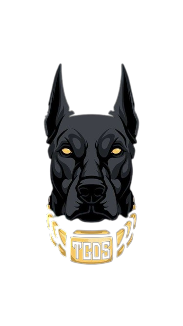

# Haruma
---
<p align="center">

</p>
"Introducing "TGOS" - a powerful subdomain brute-forcing tool. Designed in Python, Haruma efficiently explores a target domain by attempting a vast array of subdomain combinations sourced from a wordlist. With its flexible customization options, including HTTP methods and multithreading capabilities, Haruma empowers cybersecurity professionals and ethical hackers to identify potential subdomains swiftly and securely. Unleash the potential of Haruma to fortify your web security testing toolkit and enhance your domain reconnaissance endeavors."

## :pushpin: Installation :
---

``` 
  sudo apt install python3
  git clone https://github.com/SegmaSec/TGOS
  cd Haruma
  pip install -r requirements.txt
```
## :pushpin: Usage :
---
```py
python3 tgos.py -u <url> -w <wordlist> -m HEAD -t 100
```
